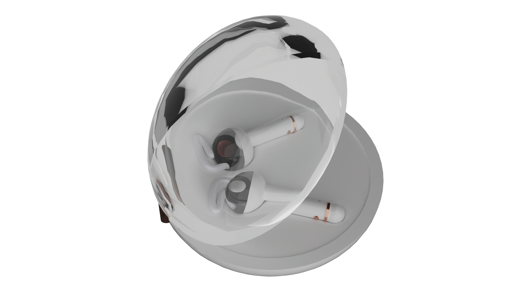

# LuxAudio Buds Pro - AR Promotional Website 🎧


*Premium wireless earbuds with augmented reality experience*

---

## 📋 Project Overview

A fully responsive, mobile-first promotional website showcasing the **LuxAudio Buds Pro** premium wireless earbuds. This project features cutting-edge web technologies including augmented reality (AR) integration, GSAP scroll animations, interactive 3D models, and a sophisticated X-ray slider component.

---

## ✨ Key Features

### 🎯 Interactive Elements
- **AR Model Viewer** - View the earbuds in your space using augmented reality
- **Interactive Hotspots** - Hover over info points to explore product features
- **X-Ray Slider** - Interactive slider revealing internal components
- **Exploded View Animation** - Scroll-triggered canvas animation (899 frames)

### 🎨 Design & UX
- **Responsive Design** - Mobile-first approach with breakpoints for tablet and desktop
- **GSAP Animations** - Smooth scroll-triggered animations throughout
- **Mobile Navigation** - Hamburger menu with smooth slide-in animation
- **Color Variants** - Showcase multiple product finishes

### ⚡ Performance
- **SASS Architecture** - Modular CSS with abstracts, base, components, and pages
- **IIFE Pattern** - Clean JavaScript encapsulation following coding standards
- **Optimized Assets** - WebP images for the exploded view sequence

---

## 🛠️ Technologies Used

| Technology | Version | Purpose |
|-----------|---------|---------|
| HTML5 | - | Semantic structure and accessibility |
| CSS3 | - | Styling and layout |
| SASS/SCSS | Latest | Modular CSS with variables, mixins, and nesting |
| JavaScript ES6+ | - | Interactive functionality with IIFE pattern |
| GSAP | 3.13.0 | Scroll animations and smooth transitions |
| ScrollTrigger | 3.13.0 | GSAP plugin for scroll-based animations |
| ScrollToPlugin | 3.13.0 | GSAP plugin for smooth scroll navigation |
| Model Viewer | 4.0.0 | Google's 3D model and AR viewer component |

---
## 🚀 Setup & Installation

### Prerequisites
- Modern web browser (Chrome, Firefox, Safari, Edge)
- SASS compiler (if modifying styles)
- Local web server (for testing AR features)

### Installation Steps

1. **Clone or download the repository**
   ```bash
   git clone https://github.com/ajaymystic/AntonyRaj_AjayChakaravarthy_EarBuds.git
   cd luxaudio-buds-pro
   ```

2. **Open the project**
   - Simply open `index.html` in your web browser
   - Or use a local server (recommended for AR features):
     ```bash
     # Using Node.js http-server
     npx http-server
     ```

3. **Compile SASS (if making changes)**
   ```bash
   # Watch for changes
   sass --watch sass:css
   
   # Compile once
   sass sass/main.scss css/main.css
   ```

---
## 📝 Credits & Resources

- **3D Model**: Custom created in Cinema 4D with RedShift rendering
- **Icons**: SVG custom icons
- **Fonts**: Helvetica Neue, Arial (system fonts)
- **Images**: Custom renders and photography
- **GSAP**: [greensock.com](https://greensock.com/)
- **Model Viewer**: [modelviewer.dev](https://modelviewer.dev/)
- **Inspiration**: Premium audio brands (Apple AirPods, Sony, Bose)
---

## 👨‍💻 Author

**Ajay Chakaravarthy Antony Raj**  